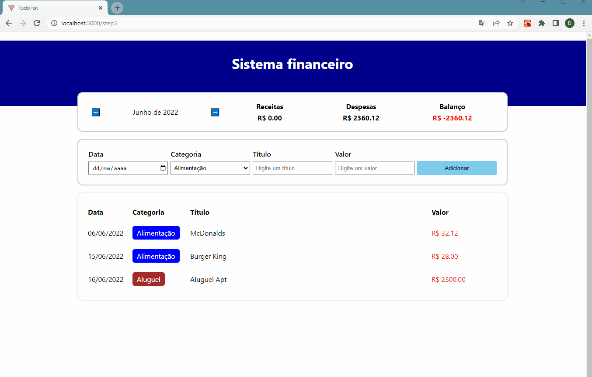

<h1>Projetos com React</h1>
<p>Projetos para prática de react</p>

<br>
<h2 id="tools">🛠️ Ferramentas</h2>

<ul>
<li>Vite-ts</li>
<li>Typescript</li>
<li>Context APi</li>
<li>Hooks</li>
<li>Styled-components</li>
</ul>

<br>
<h2 id="features">🚀 Implementação de styled-components dentro de objeto</h2>

```
# Arquivo de estilização

import styled from 'styled-components'

export const Div = {

    container: styled.div`
        background-color: #17081F;
        color: #797A81;
        min-height: 100vh;
    `,

    content: styled.div`
        margin: 0 auto;
        max-width: 980px;
        padding: 30px 10px;
    `

}


----------------------------------------------------------


# Arquivo do componente

function App() {
  const [tasks, setTasks] = useState<taskType[]>([])
  const contextValue: contextType = { tasks, setTasks }
  
  function addNewTask(text: string) {
    const newTask = { text, done: false }
    setTasks((tasks) => [...tasks, newTask])
  }

  return (
    <PageContext.Provider value={contextValue}>
      <Div.container>
        <Div.content>
      
          <H1.title>Tarefas</H1.title>
      
          <InputArea addNewTask={addNewTask} />
          {tasks.map((task, index)=> <Task key={index} task={task} index={index} />)}
      
        </Div.content>
      </Div.container>
    </PageContext.Provider>
  )
}
```

<br>
<h2 id="project">🎥 Projetos</h2>

<ul>

<br>
<li>
<h3>Formulário Multi etapas</h3>
<br>

</li><br>

<br>
<li>
<h3>Sistema financeiro</h3>
<br>

</li><br>

<br>
<li>
<h3>Todo List</h3>
<br>

</li><br>

</ul>